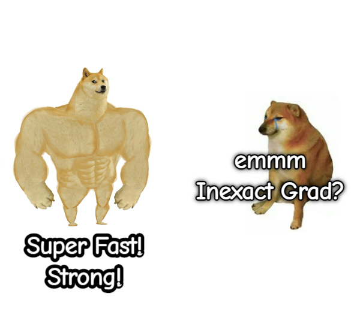

# On Training Implicit Models

This is the official repo for paper, *[On Training Implicit Models](https://arxiv.org/pdf/2111.05177.pdf)* (NeurIPS 2021).

<div align=center></div>

## Organization

You may expect to train your own implicit models through phantom gradients and reproduce the results in this paper. We offer a speedup of about 2 times regarding training DEQs.

- MDEQ
- DEQ
- IGNN

Under construction. More components will be added later.

## Reference

If you find our work helpful to your research, please consider citing this paper. :)

Bibtex is [here](https://github.com/Gsunshine/phantom_grad/blob/main/assets/phantom_grad.bib).

```bib
@article{geng2021training,
  title={On Training Implicit Models},
  author={Geng, Zhengyang and Zhang, Xin-Yu and Bai, Shaojie and Wang, Yisen and Lin, Zhouchen},
  journal={Advances in Neural Information Processing Systems},
  year={2021}
}
```

## Contact

Feel free to contact me if you have additional questions or have interests in collaboration. Please drop me an email at zhengyanggeng@gmail.com. Find me at [Twitter](https://twitter.com/ZhengyangGeng) or [WeChat](assets/WeChat.jpg). Thank you!
